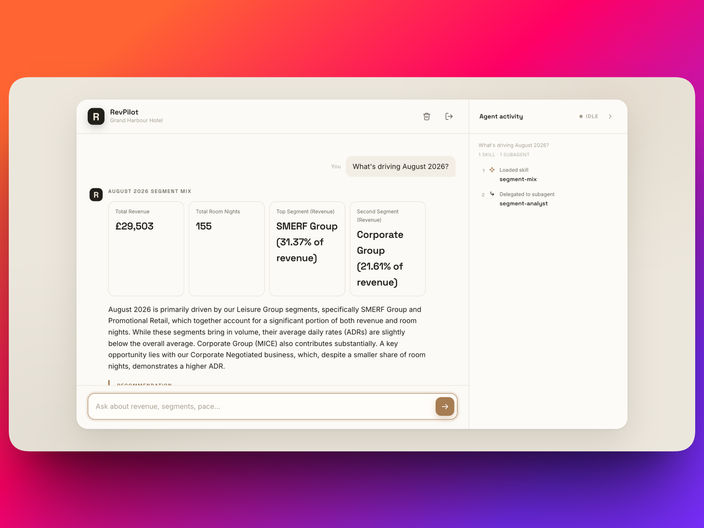

# RevPilot — AI Revenue Manager for the Grand Harbour Hotel

An AI **Revenue Manager** that briefs a hotel General Manager in plain English,
built for the [OTEL Build Challenge](https://github.com/otel-ai/otel-build-challenge).
It scrapes the live reservation data site, loads it into Postgres through an
idempotent ETL, exposes a deliberately **typed tool layer (no model-generated SQL)**,
and answers natural-language revenue questions with a **LangChain Deep Agents** agent
whose **skills encode revenue-manager judgment** — all streamed through a live chat UI
that shows every tool and skill the agent uses.

> Ask *"What's driving August 2026?"*, *"Are we too dependent on OTA?"*, or
> *"How's our booking pace?"* and get a GM-style briefing: the headline number, the
> drivers, the key risk, and a concrete recommended action.



---

## Why this submission is built the way it is

- **Correctness by construction.** The agent never writes SQL. Five typed tools with
  the business rules baked in read **only** from semantic views, and every count
  documents its grain (rows ≠ reservations ≠ room nights). The model can't get
  cancellation, grain, or revenue logic wrong because it never touches those choices.
- **Provable data load.** The ETL is idempotent (truncate-and-reload in one
  transaction) and reconciles cryptographically against the source `/verify` page:
  `row_hash` is a SHA-256 over sorted `reservation_id|stay_date|financial_status` and
  must match the site's published hash. Proof is committed to `etl/LOAD_PROOF.json`.
- **Domain judgment as skills, not prompt soup.** Eight progressive-disclosure
  `SKILL.md` files (five with explicit thresholds + recommended actions) are loaded
  on demand — OTA dependency, pickup pace, block concentration, pricing/ADR,
  cancellations — plus an adversarial data-guardrails skill.
- **Real agent engineering.** Planning middleware decomposes multi-part questions, a
  `segment-analyst` subagent isolates mix work, a **human-in-the-loop gate** pauses
  before the expensive point-in-time rebuild, and a Postgres checkpointer gives
  durable multi-turn memory.
- **Observable & traceable.** The right-hand panel streams each tool call and skill
  load live, so every number in an answer is auditable.
- **Production touches.** Supabase Auth (invite-only), a public `/health` fingerprint
  for reconciliation, per-user conversation isolation, and **43 tests** (structural
  ones need no LLM, so they run in CI).

## Architecture at a glance

```
Live data site ──Playwright──▶ ETL (scrape → transform → load) ──▶ Supabase Postgres
                                                                     │  (facts + lookups + semantic views)
                                                                     ▼
                                          5 typed tools (no raw SQL) ──▶ Deep Agent
                                          skills · subagent · planning · memory · HITL
                                                                     ▼
                                          FastAPI: streaming chat UI + /health + Supabase Auth
```

**The core fact grain is one row per `reservation × stay_date`** — every tool is
built around it. Correctness lives in the typed tools, not in model-generated SQL.

Deeper docs: **[ARCHITECTURE.md](ARCHITECTURE.md)** (full design) ·
[tools/METRIC_DEFINITIONS.md](tools/METRIC_DEFINITIONS.md) (grain/metric rules) ·
[ATTESTATION.md](ATTESTATION.md) (comprehension write-up).

## Stack

Python 3.11+ · Playwright · psycopg 3 · Supabase (hosted Postgres) · deepagents +
LangChain / LangGraph · FastAPI + Uvicorn · model via OpenRouter (provider-agnostic).

## Prerequisites

- Python 3.11+
- A **Supabase** project (Postgres + Auth) — free tier is enough
- An **OpenRouter** API key (or any provider supported by `MODEL_ID`)
- Chromium for Playwright (installed below) — only needed to run the ETL scraper

## Setup

```bash
python3 -m venv .venv && . .venv/bin/activate
pip install -r requirements.txt
playwright install chromium          # only needed to run the ETL scraper
cp .env.example .env                 # then fill in the values
```

`.env` keys (see [.env.example](.env.example)):

| Key | Purpose |
|---|---|
| `DATABASE_URL` | Supabase Postgres (session-pooler URI) |
| `MODEL_ID` | dev: `openrouter:google/gemini-2.5-flash`; deployed: `openrouter:google/gemini-2.5-pro` (also `google_genai:`, `openai:`) |
| `OPENROUTER_API_KEY` | model gateway key |
| `SUPABASE_URL` / `SUPABASE_ANON_KEY` | Supabase project API URL + anon key (Project Settings → API); used for sign-in |

## Running

**1 — Apply schema + semantic views** (once per database):
```bash
PYTHONPATH=. python scripts/apply_sql.py schema.sql sql/views.sql
```

**2 — Run the ETL** (scrape the live site → load → manifests), then prove the load:
```bash
python -m etl.run_etl
python scripts/compute_load_fingerprint.py --manifest etl/SCRAPE_MANIFEST.json --output etl/LOAD_PROOF.json
```
The dataset regenerates daily from an **anchor date**, so scrape, load, and submit on
the **same calendar day** — counts reconcile with `/verify` for that anchor.

**3 — Run the tests:**
```bash
pytest -q
```

**4 — Run the app:**
```bash
PYTHONPATH=. uvicorn app.main:app --port 8077
# open http://127.0.0.1:8077  (sign in with your username + password)
```
`GET /health` returns the live DB fingerprint (`db_fingerprint`, `dataset_revision`,
`row_hash`, `financial_status_posted_only_rows`) for reconciliation against
`etl/LOAD_PROOF.json`.

## Auth

Sign-in is handled by **Supabase Auth — username + password, invite-only**. Supabase
keys accounts by email, so the UI maps a username to a fixed domain
(`gm` → `gm@revpilot.com`); users only ever see a username. The backend verifies each
request's access token against Supabase GoTrue — **no JWT secret is stored** — and
namespaces each conversation under the signed-in user.

One-time provisioning in the Supabase dashboard:

1. **Authentication → Users → Add user**: create the account with email
   `<username>@revpilot.com` and a password (dashboard-created users are auto-confirmed).
2. **Authentication → Sign In / Providers → Email**: disable new user signups.
3. Set `SUPABASE_URL` and `SUPABASE_ANON_KEY` (Project Settings → API) in `.env`.

## Testing

```bash
pytest -q        # 43 tests
```

| Suite | Count | What it covers |
|---|---|---|
| `tests/test_etl.py` | 4 | lookup counts, grain uniqueness, manifest ↔ DB reconciliation, multi-night expansion |
| `tests/test_tools.py` | 14 | tool-layer behaviour against the loaded DB (grain, filters, shares, as-of, room-type ADR, no-raw-SQL) |
| `tests/test_skills.py` | 7 | skill-pack pin, count, judgment thresholds, tool routing, distinctness, guardrail — no LLM |
| `tests/test_agent.py` | 10 | fixed 5-tool surface, HITL gate, isolated subagent, on-demand skills, memory, planning, coverage ranges — no LLM |
| `tests/test_auth.py` | 8 | token verification, `require_auth` (missing/invalid/valid bearer), `/config`, per-user thread namespacing — GoTrue mocked |

Structural tests (`test_skills`, `test_agent`, `test_auth`) make no network/LLM calls;
the ETL/tool tests run against the loaded Supabase DB.

## Repo layout

```
etl/        scrape.py · transform.py · load.py · run_etl.py · manifests · SITE_NOTES.md
sql/        views.sql (semantic views) · relax_fk.sql
tools/      rm_tools.py (5 typed tools) · METRIC_DEFINITIONS.md
skills/     8 SKILL.md (5 judgment) + CHALLENGE_SKILL.md (pack otel-rm-v2)
agent/      build_agent.py (create_deep_agent wiring)
app/        main.py (FastAPI: chat SSE + /health + /config) · auth.py · checkpointer.py · static/
tests/      test_etl.py (4) · test_tools.py (14) · test_skills.py (7) · test_agent.py (10) · test_auth.py (8)
scripts/    apply_sql.py · compute_load_fingerprint.py
```

## Design decisions & notes

- **Deploy topology:** hosted Postgres (Supabase) + the FastAPI container on an
  always-on host; the model is served via OpenRouter (key set in the deployment env,
  never committed).
- **Model split:** dev runs `gemini-2.5-flash` (cheap, fast iteration); the deployed
  build sets `MODEL_ID=openrouter:google/gemini-2.5-pro` for the live review — stronger
  reasoning and instruction-following on multi-part and adversarial questions. Nothing
  else changes; it's a single env var.
- **Data-quality decision:** source bookings carry granular rate codes beyond the
  8-row `rate_plan_lookup`, so the brief's `rate_plan_code` FK is intentionally relaxed
  (`sql/relax_fk.sql`); the other dimensions are verified clean by the ETL's
  `integrity_report`. See [etl/SITE_NOTES.md](etl/SITE_NOTES.md).
- **Out of scope (deliberate):** a daily scrape cron (same-day reconcile is
  sufficient), heavy UI styling, MCP servers (optional bonus), and multi-hotel support.
- Built in its own repository (not a fork of the brief), per the challenge rules.
```
